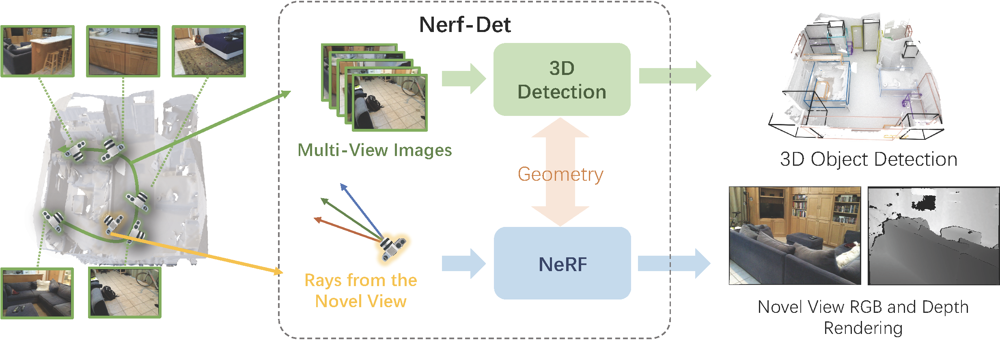
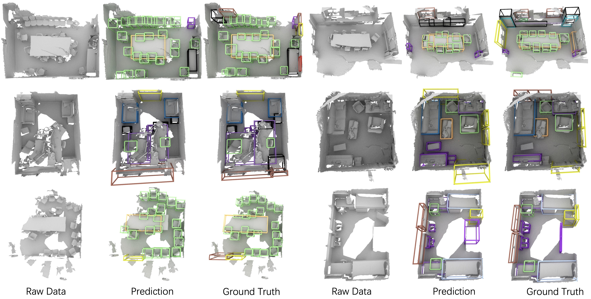
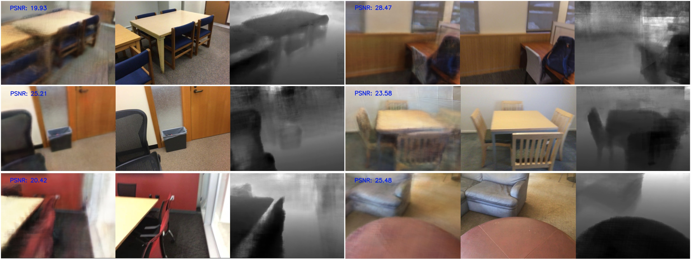

# NeRF-Det: Learning Geometry-Aware Volumetric Representation for Multi-View 3D Object Detection [ICCV 2023]

*[Chenfeng Xu](https://chenfengx.com), [Bichen Wu](https://scholar.google.com/citations?user=K3QJPdMAAAAJ&hl=en), [Ji Hou](https://sekunde.github.io), [Sam Tsai](https://scholar.google.com/citations?user=JdE_LFYAAAAJ&hl=zh-CN), [Ruilong Li](https://www.liruilong.cn), [Jialiang Wang](https://scholar.harvard.edu/jwang/home), [Wei Zhan](https://zhanwei.site), [Zijian He](https://scholar.google.com/citations?user=G03EzSMAAAAJ&hl=en), [Peter Vajda](https://sites.google.com/site/vajdap), [Kurt Keutzer](https://people.eecs.berkeley.edu/~keutzer/), [Masayoshi Tomizuka](https://me.berkeley.edu/people/masayoshi-tomizuka/)*

*[[paper]](http://arxiv.org/abs/2307.14620), [[project page]](https://chenfengxu714.github.io/nerfdet/)*
<p align="center"></p>

NeRF-Det is a novel method for 3D detection with posed RGB images as input. Our method makes novel use of NeRF in an end-to-end manner to explicitly estimate 3D geometry, thereby improving 3D detection performance. Specifically, to avoid the significant extra latency associated with per-scene optimization of NeRF, we introduce sufficient geometry priors to enhance the generalizability of NeRF-MLP. We subtly connect the detection and NeRF branches through a shared MLP, enabling an efficient adaptation of NeRF to detection and yielding geometry-aware volumetric representations for 3D detection. As a result of our joint-training design, NeRF-Det is able to generalize well to unseen scenes for object detection, view synthesis, and depth estimation tasks without per-scene optimization. 

<p align="center"></p>

Inspired by our previous work [SOLOFusion](https://openreview.net/forum?id=H3HcEJA2Um), we further advance our method with using long-frame-low-res images, which is more efficient and effective. We provide the checkpoints and configs with better performance below.

|   Method       | mAP@25 | mAP@50 | Checkpoint | Config | 
| ---------------|------|-----|--------|------------|
| NeRF-Det-R50    | 53.1 |27.8 |  [link](https://drive.google.com/file/d/1WTTsjz-N1N_2qM90SSplq6vDVPfDUfPD/view?usp=sharing)   | [config](configs/nerfdet/nerfdet_res50_2x_low_res.py)       |
| NeRF-Det-R50*    | 52.4 | 29.2| [link](https://drive.google.com/file/d/1CyXYdOOkneizddaA547JhiWKZ5sH-H6q/view?usp=sharing)   | [config](configs/nerfdet/nerfdet_res50_2x_low_res_depth_sp.py)       |
| NeRF-Det-R101*    | 52.6 | 29.8 | [link](https://drive.google.com/file/d/1PDhFput3GxGcEBx-ILv0AHGte6Cr0snr/view?usp=drive_link)  | [config](configs/nerfdet/nerfdet_res101_2x_low_res_depth_sp.py)        |

If you find this work helpful, please cite:

**Citation**:
```
@inproceedings{
  xu2023nerfdet,
  title={NeRF-Det: Learning Geometry-Aware Volumetric Representation for Multi-View 3D Object Detection},
  author={Xu, Chenfeng and Wu, Bichen and Hou, Ji and Tsai, Sam and Li, Ruilong and Wang, Jialiang and Zhan, Wei and He, Zijian and Vajda, Peter and Keutzer, Kurt and Tomizuka, Masayoshi},
  booktitle={ICCV},
  year={2023},
}

@inproceedings{
park2023time,
title={Time Will Tell: New Outlooks and A Baseline for Temporal Multi-View 3D Object Detection},
author={Jinhyung Park and Chenfeng Xu and Shijia Yang and Kurt Keutzer and Kris M. Kitani and Masayoshi Tomizuka and Wei Zhan},
booktitle={The Eleventh International Conference on Learning Representations },
year={2023},
url={https://openreview.net/forum?id=H3HcEJA2Um}
}
```

## Installation ##

For convenience, we provide a [Dockerfile](docker/Dockerfile). Alternatively, you can install all required packages manually.

This implementation is based on [mmdetection3d](https://github.com/open-mmlab/mmdetection3d) framework and [ImVoxelNet](https://github.com/SamsungLabs/imvoxelnet).
Please refer to the original installation guide [install.md](docs/install.md), replacing `open-mmlab/mmdetection3d` with `saic-vul/imvoxelnet`.
Also, [rotated_iou](https://github.com/lilanxiao/Rotated_IoU) should be installed with [these](https://github.com/saic-vul/imvoxelnet/blob/master/docker/Dockerfile#L31-L34) 4 commands.

Most of the `NeRF-Det`-related code locates in the following files: 
[detectors/nerfdet.py](mmdet3d/models/detectors/nerfdet.py), [model_utils/render_ray.py](mmdet3d/models/model_utils/render_ray.py), [model_utils/projection.py](mmdet3d/models/model_utils/projection.py), [pipelines/multi_view.py](mmdet3d/datasets/pipelines/multi_view.py),
[pipelines/formating.py](mmdet3d/datasets/pipelines/formating.py).

## Dataset ##

We provide the code of **ScanNet** experiments. Please follow instructions in [scannet](data/scannet) to prepare the dataset.

## Getting Started ##

Please see [getting_started.md](docs/getting_started.md) for basic usage examples.

## Testing ##

Test pre-trained model using [dist_test](tools/dist_test.sh) with `nerfdet` [configs](configs/nerfdet):
```shell
bash tools/dist_test.sh configs/nerfdet/nerfdet_res50_2x_low_res.py \
    work_dirs/nerfdet_res50_2x_low_res/res50_2x_low_res.pth 4 --eval mAP
```

## Visualization ##

If you want to render novel view, you can modify let "render_testing = True" in config. You can then get results like below.

<p align="center"></p>

if you want to have the bounding box visualization, you can run
```shell
python tools/test.py configs/nerfdet/nerfdet_res50_2x_low_res.py \
    work_dirs/nerfdet_res50_2x_low_res/latest.pth --show \
    --show-dir work_dirs/nerfdet_res50_2x_low_res
```
For better visualizations, you may set `score_thr` in configs to `0.15` or more:


## Training ##

You can train your own model by the training script
```shell
bash tools/dist_train.sh configs/nerfdet/nerfdet_res50_2x_low_res.py 4
```

## Acknowledgement ##

https://github.com/SamsungLabs/imvoxelnet

https://ibrnet.github.io

https://github.com/open-mmlab/mmdetection3d

## License
Nerf-Det is relased under the MIT License. See the LICENSE file for more details.
